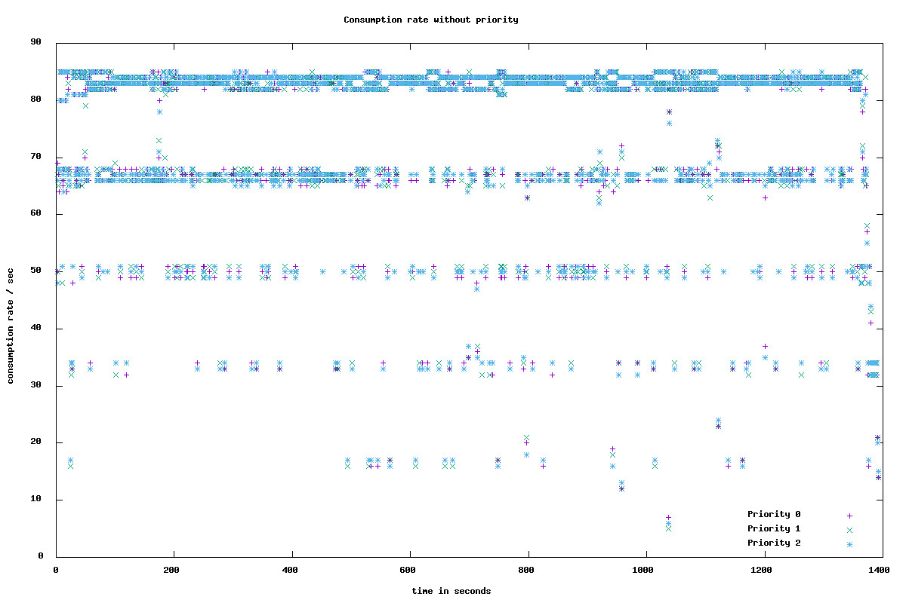
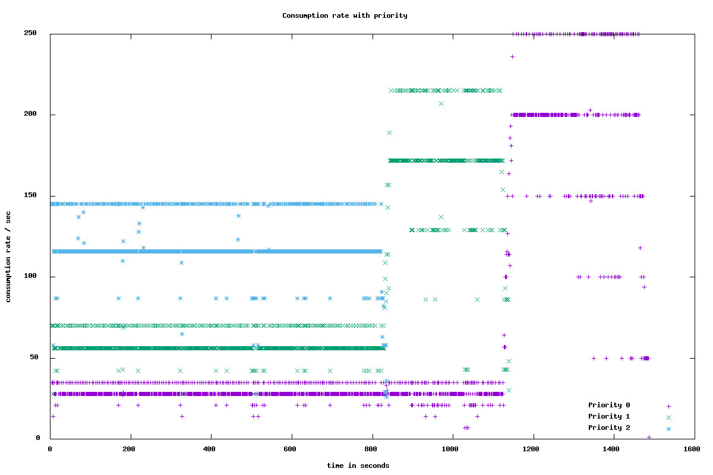
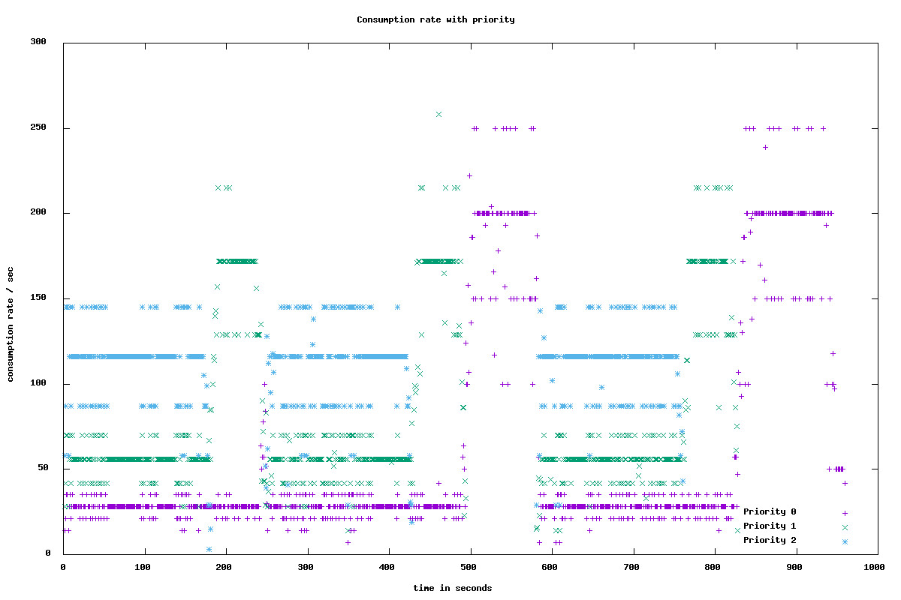

# Priority Kafka Client
Kafka Client that allows records to produce to and consume from Kafka on configured priority levels

## Releases
| Release | Date | Description |
|:------------|:----------------|:------------|
| Version 1.0.0             | Oct 01 2018      |    First release

## Changelog

Changelog can be viewed in [CHANGELOG.md](CHANGELOG.md)

## Getting Started

This client provides abstraction to implement Kafka's ```Producer<K, V>``` and ```Consumer<K, V>``` with priority support.

It provides ```capacity burst``` based general purpose prioritized Kafka queueing implementation. In this context, priority is a positive integer (N) with priority levels ```0 < 1 < ... < N-1```


### PriorityKafkaProducer
| Config | Mandatory | Description |
|:------------|:----------------|:------------|
| max.priority             | Yes      |    Defines max priority
Rest of the configs are similar to that of ```KafkaProducer```.

```PriorityKafkaProducer``` takes in an additional arg of priority level ```Future<RecordMetadata> send(int priority, ProducerRecord<K, V> record)```. This is an indication to produce record on that priority level. ```Future<RecordMetadata> send(int priority, ProducerRecord<K, V> record)``` defaults the record production on the lowest priority level 0. For every logical topic ```XYZ``` - priority level ```0 <= i < N``` is backed by Kafka topic ```XYZ-i```

### CapacityBurstPriorityKafkaConsumer
| Config | Mandatory | Description |
|:------------|:----------------|:------------|
| max.priority             | Yes      |    Defines max priority
| group.id             | Yes      |    Defines logical group ID for the consumer
| max.poll.records             | Yes      |    Defines max records to be polled across priority levels
| max.poll.history.window.size             | No      |    This is window length to track historical counts of records obtained from ```poll()```. Defaulted to 6
| min.poll.window.maxout.threshold             | No      |    This is threshold on how many historical counts os records obtained from ```poll()``` maxed out w.r.t. ```max.poll.records``` config. Defaulted to 4
Rest of the configs are similar to that of ```KafkaConsumer```.

CapacityBurstPriorityKafkaConsumer implementation maintains a ```KafkaConsumer``` for every priority level ```0 <= i < N```. For every logical topic ```XYZ``` and logical group ID ```ABC``` - priority level ```0 <= i < N``` consumer binds to Kafka topic ```XYZ-i``` with group ID ```ABC-i```. This works in tandem with ```PriorityKafkaProducer```.

```max.poll.records``` property is split across priority topic consumers based on
```maxPollRecordsDistributor``` - defaulted to ```ExpMaxPollRecordsDistributor```. Rest of the ```KafkaConsumer``` configs are passed as is to each of the priority topic consumers. Care has to be taken when defining ```max.partition.fetch.bytes```, ```fetch.max.bytes``` and ```max.poll.interval.ms``` as these values will be used as is across all the priority topic consumers.

Works on the idea of distributing ```max.poll.records``` property across each of the priority topic consumers as their reserved capacity. Records are fetched sequentially from all priority level topics consumers which are configured with distributed ```max.poll.records``` values. The distribution must reserve higher capacity or processing rate to higher priorities.

```Caution 1``` - if we have skewed partitions in priority level topics e.g. 10K records in a priority 2 partition, 100 records in a priority 1 partition, 10 records in a priority 0 partition that are assigned to different consumer threads, then the implementation will not synchronize across such consumers to regulate capacity and hence will fail to honour priority. So the producers must ensure there are no skewed partitions (e.g. using round-robin - this "may" imply there is no message ordering assumptions and the consumer may choose to process records in parallel by separating out fetching and processing concerns).

```Caution 2``` - If we have empty partitions in priority level topics e.g. no pending records in assigned priority 2 and 1 partitions, 10K records in priority 0 partition that are assigned to the same consumer thread, then we want priority 0 topic partition consumer to burst its capacity to ```max.poll.records``` and not restrict itself to its reserved capacity based on ```maxPollRecordsDistributor``` else the overall capacity will be under utilized.

This implementation will try to address cautions explained above. Every consumer object will have individual priority level topic consumers, with each priority level consumer having reserved capacity based on ```maxPollRecordsDistributor```. Each of the priority level topic consumer will try to burst into other priority level topic consumer's capacity in the group provided all the below are true:
* It is eligible to burst - This is if in the last ```max.poll.history.window.size``` attempts of ```poll()``` atleast ```min.poll.window.maxout.threshold``` times it has received number of records equal to assigned ```max.poll.records``` which was distributed based on ``` maxPollRecordsDistributor```. This is an indication that the partition has more incoming records to be processed.
* Higher priority level is not eligible to burst - There is no higher priority level topic consumer that is eligible to burst based on above logic. Basically give way to higher priorities.

If the above are true, then the priority level topic consumer will burst into all other priority level topic consumer capacities. The amount of burst per priority level topic consumer is equal to the least un-used capacity in the last ```max.poll.history.window.size``` attempts of ```poll()```.

For example say we have:
```
max.priority = 3;
max.poll.records = 50;
maxPollRecordsDistributor = ExpMaxPollRecordsDistributor.instance();
max.poll.history.window.size = 6;
min.poll.window.maxout.threshold = 4;
```
Capacity distribution of ```max.poll.records``` property is ```{2=29, 1=14, 0=7}```.

```
Case 1: FIFO view of poll window is
2 - [29, 29, 29, 29, 29, 29];
1 - [14, 14, 14, 14, 14, 14];
0 - [7, 7, 7, 7, 7, 7];
In this case every priority level topic consumer will retain its
capacity and not burst as everyone is eligible to burst but no
one is ready to give away reserved capacity.
```
```
Case 2: FIFO view of poll window is
2 - [29, 29, 29, 29, 29, 29];
1 - [14, 14, 14, 11, 10, 9];
0 - [7, 7, 7, 7, 7, 7];
In this case every priority level topic consumer will retain its
capacity and not burst as everyone is eligible to burst but no
one is ready to give away reserved capacity.
```
```
Case 3: FIFO view of poll window is
2 - [29, 29, 29, 29, 29, 29];
1 - [10, 10, 7, 10, 9, 0];
0 - [7, 7, 7, 7, 7, 7];
In this case priority level 2 topic consumer will burst into
priority level 1 topic consumer's capacity and steal (14 - 10 = 4),
hence increasing its capacity or max.poll.records property to
(29 + 4 = 33).
```
```
Case 3: FIFO view of poll window is
2 - [20, 25, 25, 20, 15, 10];
1 - [10, 10, 7, 10, 9, 0];
0 - [7, 7, 7, 7, 7, 7];
In this case priority level 0 topic consumer will burst into
priority level 2 and 1 topic consumer capacities and steal
(29 - 25 = 4 and 14 - 10 = 4), hence increasing its capacity
or max.poll.records property to (7 + 8 = 15).
```
### Client in Action
```
Kafka broker version - 0.10.1.1
max.priority - 3
max.poll.records - 50
Records - 100000 per priority level (300000 overall)
Consumer Processing - 1 sec sleep for every record
```
Code for Experiments can be found at [Example.java](src/test/java/com/flipkart/priority/kafka/client/example/Example.java)

##### Experiment 1 - Without prioritization
```Producer``` - Produce 100000 records for each of 3 priority levels to a single topic with 15 partitions using ```KafkaProducer```.

```Consumer``` - Maintain 5 consumer threads to fetch messages using ```KafkaConsumer```. Each consumer thread uses a Fixed threadpool of size 55 to process records parallely and commitSync once processing is done



Here we observe all the records are processed at the same rate without any notion of priority.

##### Experiment 2 - With prioritization
```Producer``` - Produce 100000 records for each of 3 priority levels to 3 topics with 5 partitions each using ```PriorityKafkaProducer```.

```Consumer``` - Maintain 5 consumer threads to fetch messages using ```CapacityBurstPriorityKafkaConsumer```. Each consumer thread uses a Fixed threadpool of size 55 to process records parallely and commitSync once processing is done



Here we observe priority level 2 records are processed at a faster rate compared to priority levels 1 and 0. Once priority level 2 records are exhausted, then priority level 1 takes over priority level 2's capacity and bursts its processing rate. Similarly once priority level 1 records drain, priority level 0 takes over capacities of priority levels 2 and 1 and bursts its processing rate.

##### Experiment 3 - With prioritization

This is an extension to Experiment 2



Here we observe initially priority level 2 records are processed at a faster rate compared to priority levels 1 and 0. Once priority level 2 records are exhausted, then priority level 1 takes over priority level 2's capacity and bursts its processing rate. But once priority level 2 records start pouring in, then priority level 1 unlocks the burst capacity and everyone fallback to their reserved capacities.

## Contribution, Bugs and Feedback

For bugs, questions and discussions please use the [Github Issues](https://github.com/flipkart-incubator/priority-kafka-client/issues).
Please follow the [contribution guidelines](CONTRIBUTING.md) when submitting pull requests.

## License

Copyright 2018 Flipkart Internet, pvt ltd.

Licensed under the Apache License, Version 2.0 (the "License");
you may not use this file except in compliance with the License.
You may obtain a copy of the License at

http://www.apache.org/licenses/LICENSE-2.0

Unless required by applicable law or agreed to in writing, software
distributed under the License is distributed on an "AS IS" BASIS,
WITHOUT WARRANTIES OR CONDITIONS OF ANY KIND, either express or implied.
See the License for the specific language governing permissions and
limitations under the License.
